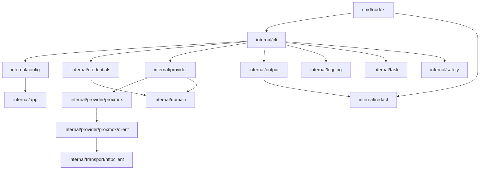

# Architecture

Nodex is a single-process Go CLI. The command entry point wires signal handling, command parsing, configuration, credential resolution, provider connections, output formatting, and redacted error reporting.

## Component overview



## Package layout

```text
cmd/nodex/                         Process entry point and signal handling
internal/app/                      Shared application errors and exit codes
internal/cli/                      Command registration, global flags, handlers, shell completion
internal/config/                   YAML schema (v1-v2), config paths, validation, atomic writes, locking
internal/credentials/              Credential backends (file, keyring, env, stdin) and resolution
internal/domain/                   Provider interface, capability interfaces, shared resource types
internal/logging/                  Stderr logger and log levels
internal/output/                   Table, JSON, YAML, OperationResult envelope, redaction-aware formatting
internal/provider/                 Provider registry and capability helpers
internal/provider/pbs/             Proxmox Backup Server provider and resource mapping
internal/provider/pbs/client/      Typed PBS HTTP API client
internal/provider/proxmox/         Proxmox VE provider implementation and resource mapping
internal/provider/proxmox/client/  Typed Proxmox VE HTTP API client
internal/redact/                   Secret redaction helpers
internal/safety/                   Mutation safety classification and confirmation policy
internal/task/                     UPID parsing and exponential-backoff task polling
internal/transport/httpclient/     HTTP client with TLS, timeout, retry, DoMutation, body limits
internal/version/                  Build metadata resolution
```

## Runtime flow

1. `cmd/nodex/main.go` creates a cancellable context and registers SIGINT/SIGTERM handlers.
2. `internal/cli.Run` parses global flags with Go's `flag` package.
3. The CLI dispatches to a command handler registered in `internal/cli/root.go`.
4. Commands that need provider access read the configuration, choose a profile, resolve credentials, create the provider, and defer provider cleanup.
5. The Proxmox provider uses the internal Proxmox client to call API endpoints.
6. Command handlers render table, JSON, or YAML output, or an `OperationResult` for mutations.
7. Returned errors are redacted and terminal-sanitized before they are printed by `main`.

## CLI dispatch

Commands are registered via `internal/cli/root.go` using a `register()` function that builds a tree of named commands with subcommands. Top-level commands dispatch to handlers in `internal/cli/` (e.g., `runVMStart`, `runNodeList`, `runProfileAdd`).

Global flags are parsed before the command name with Go's standard `flag` package:

| Flag | Type | Default | Description |
|------|------|---------|-------------|
| `--profile` | string | "" | Override current profile |
| `--output` | string | table/json | Output format: table, json, yaml |
| `--timeout` | duration | 30s | Provider request timeout |
| `--limit` | int | 0 | Limit output items (0 = no limit) |
| `--all` | bool | false | Aggregate across all configured profiles |
| `--no-color` | bool | false | Disable color output |
| `--non-interactive` | bool | false | Disable interactive prompts |
| `--quiet` | bool | false | Suppress non-essential output |
| `--verbose` | bool | false | Info-level stderr output |
| `--debug` | bool | false | Debug-level stderr output (redacted) |

Mutation flags:

| Flag | Type | Description |
|------|------|-------------|
| `--yes` | bool | Confirm reversible operations (Tier 1) |
| `--force` | bool | Confirm disruptive operations (Tier 2, requires `--yes`) |
| `--wait` | bool | Wait for provider task to complete before exiting |
| `--expert` | bool | Enable expert-mode operations (Tier 4: identity, ACL changes) |
| `--password-stdin` | bool | Read password from stdin instead of interactive prompt |

## Safety authorization

`internal/safety` implements a five-tier safety model:

| Tier | Name | Confirmation |
|------|------|-------------|
| 0 | Observation | None required |
| 1 | Reversible | `--yes` or interactive prompt |
| 2 | Disruptive | `--yes --force` or double confirmation |
| 3 | Destructive | Type-in target verification |
| 4 | SecurityAdmin | `--expert` flag |

Each operation declares a `ConfirmationPolicy` with its tier, resource description, and optional type-confirm target. The `Check` method evaluates flags and interactivity mode to produce a `ConfirmationResult`.

Non-interactive sessions fail closed when confirmation is required.

## Provider registry

Providers are registered by name through `internal/provider.Register`. The Proxmox provider registers itself from its package `init` function. The registry supports listing, looking up by name, and checking registration status.

```go
provider.Register("proxmox", func() domain.Provider { return &proxmox.Provider{} })
```

Provider naming is stable: `proxmox` is Proxmox VE, and `pbs` is reserved for
the Proxmox Backup Server provider planned in
[ADR 0001](adr/0001-fleet-operations-architecture.md) and tracked in the
[fleet-operations roadmap](roadmap.md). Each provider is its own package with
its own typed client; providers share transport, credential, redaction,
safety, and task infrastructure but never each other's client code.

## Provider interface

The base `domain.Provider` interface defines six lifecycle and discovery methods:

| Method | Purpose |
|--------|---------|
| `Name()` | Provider name |
| `Version()` | Provider version |
| `Connect()` | Initialize with endpoint and credentials |
| `Close()` | Release resources |
| `Health()` | Provider responsiveness check |
| `Capabilities()` | List supported capabilities |

Resource inspection methods (listing nodes, VMs, containers, storage, cluster info, tasks, snapshots, events, syslog, backups, firewall rules, HA resources) live in narrow **inspector interfaces** (e.g., `NodeInspector`, `VMInspector`, `ContainerInspector`). A provider implements only the inspectors for the resource families it supports.

### Optional capability interfaces

Beyond the base interface, providers can implement optional interfaces for additional capabilities. The Proxmox provider currently implements:

- **NodeDetailProvider** — node status, services, network, DNS, time, disks, certificates, subscription, updates
- **FirewallProvider** — aliases, IP sets, security groups, options, node/VM firewall rules
- **HAProvider** — HA status, current HA state
- **BackupProvider** — backup content listing
- **SDNProvider** — SDN zones and VNets
- **PoolProvider** — resource pools
- **ClusterLogProvider** — cluster-wide log entries
- **ClusterStatusProvider** — cluster quorum and node health
- **SnapshotDetailProvider** — VM/CT snapshot configuration
- **LifecycleProvider** — VM and container start, stop, shutdown, reset, reboot, suspend, resume, pause, unpause
- **ConfigProvider** — VM and container configuration updates
- **SnapshotMutationProvider** — snapshot create, delete, rollback
- **DeleteProvider** — VM and container deletion
- **TemplateProvider** — template conversion
- **CloudInitProvider** — cloud-init regeneration
- **BackupMutationProvider** — backup creation, restore, schedule management
- **StorageMutationProvider** — content upload, download, delete
- **MigrationProvider** — VM and container migration
- **CloneProvider** — VM and container cloning
- **DiskProvider** — VM disk resize and move
- **NetworkMutationProvider** — network configuration apply and revert
- **FirewallMutationProvider** — rule, alias, IP set, group, and options mutations
- **AccessProvider** — user, group, role, ACL, domain, and token management
- **CephProvider** — Ceph status, OSDs, monitors, pools
- **CephMutationProvider** — Ceph OSD and pool mutations
- **SDNMutationProvider** — SDN zone, VNet, subnet, and controller mutations
- **ReplicationProvider** — replication job CRUD and scheduling

## Proxmox provider

The Proxmox provider (`internal/provider/proxmox/`) is the built-in provider. It:

- Normalizes and validates endpoint URLs (HTTPS required, no userinfo, query strings, or fragments)
- Authenticates with Proxmox's `PVEAPIToken` authorization scheme
- Uses the typed Proxmox client (`internal/provider/proxmox/client/`) for all API calls
- Maps Proxmox API response fields into `internal/domain` resource types through mapper functions

The provider advertises 31 capabilities covering read-only inspection, node details, firewall, HA, backups, SDN, snapshots, pools, cluster logs, lifecycle, config, snapshot mutation, delete, template, cloud-init, backup mutation, storage mutation, migration, clone, disk, network mutation, firewall mutation, access, Ceph, Ceph mutation, SDN mutation, and replication.

## PBS provider

The Proxmox Backup Server provider (`internal/provider/pbs/`) is a separate
first-class provider with its own typed client
(`internal/provider/pbs/client/`). It shares the transport, credential,
redaction, safety, and output infrastructure with the Proxmox VE provider but
none of its client code, and PBS resources use PBS-native domain models
(datastores, backup snapshots, namespaces, verify/prune/sync jobs, garbage
collection) rather than PVE shapes.

- Authenticates with PBS's `PBSAPIToken` authorization scheme
  (`PBSAPIToken=user@realm!tokenname:secret` — note the `:` separator where
  PVE uses `=`)
- Same endpoint policy as PVE: HTTPS only, no userinfo/path/query, additive
  custom CA, no insecure mode
- Treats PBS task UPIDs as opaque validated identifiers; the PBS UPID wire
  format differs from PVE's (it ends with the authenticating `authid`)
- Advertises 6 read-only capabilities (`pbs_system`, `pbs_datastores`,
  `pbs_snapshots`, `pbs_tasks`, `pbs_jobs`, `pbs_gc`) backed by the
  `PBSSystemInspector`, `PBSDatastoreInspector`, `PBSSnapshotInspector`,
  `PBSTaskInspector`, `PBSJobInspector`, and `PBSGCInspector` interfaces in
  `internal/domain`
- Advertises 4 guarded mutation capabilities (`pbs_verify_run` reversible,
  `pbs_sync_run` disruptive, `pbs_prune_run` destructive, `pbs_gc_run`
  disruptive) backed by the `PBSVerifyRunner`, `PBSSyncRunner`,
  `PBSPruneRunner`, and `PBSGCRunner` interfaces. Mutations POST through
  `DoMutation` (exactly once, no automatic retry), are host-pinned to the
  configured endpoint, validate job/datastore identifiers before building
  paths, and return task UPIDs; the CLI layer adds confirmation gates and a
  conflicting-task preflight

## HTTP transport

`internal/transport/httpclient` wraps `net/http` with:

- Default timeout of 30s
- TLS minimum version 1.2
- Custom CA file support via `WithCACert()`
- No insecure TLS mode
- Maximum successful response body size of 50 MiB
- Maximum API error body size of 256 KiB
- Up to 2 retries for non-TLS transport errors and HTTP 5xx responses
- Retry delays with exponential backoff and ±25% jitter (base 200ms, max 500ms)

### Read vs mutation transport

The client provides two request methods:

- **`Do()`** — used for GET requests. Retries on transient errors and 5xx responses. TLS and certificate errors are not retried.
- **`DoMutation()`** — used for POST, PUT, and DELETE requests. Executes exactly once with no automatic retry, preventing unsafe repeated state changes.

## Task lifecycle

`internal/task` provides:

- **UPID parsing.** Parses standard Proxmox UPID format (`UPID:<node>:<hex_pid>:...`) and a simplified test format (`UPID:<node>/<pid>/<pstart>`).
- **Task polling.** `Poller.Wait()` polls a task endpoint with exponential backoff until completion, timeout, or cancellation.
  - Initial interval: 500ms
  - Max interval: 5s
  - Backoff factor: 2.0x
  - Max total wait: 30 minutes
- **Task states.** Running and Stopped. Stopped tasks report OK or failure status.
- **Cancellation.** Context cancellation stops polling and returns the UPID for manual follow-up.

CLI commands that create provider tasks return an `OperationResult` with the UPID. When `--wait` is used, the command polls the task and reports the final outcome.

## Output model

`internal/output` provides:

- **Table output.** Human-readable terminal tables. Byte values in IEC units. Not stable for scripting.
- **JSON output.** Indented with two spaces. Empty lists are `[]`. Structured and parseable.
- **YAML output.** Native YAML serialization mirroring the JSON shape.
- **OperationResult.** Standard envelope for state-changing commands with schema version, operation name, profile, provider, target, safety tier, UPID, submission status, wait status, success, changed flag, status text, warnings, and classified error details.
- **Redaction.** All output passes through `internal/redact` before writing. Terminal output is sanitized for escape sequences.

## Credential flow

`internal/credentials` provides:

| Backend | Read | Write | Description |
|---------|------|-------|-------------|
| `file` | yes | yes | JSON files under `~/.nodex/credentials/` |
| `keyring` | yes | yes | OS keyring via `github.com/zalando/go-keyring` |
| `env` | yes | no | Environment variables |
| `stdin` | yes | no | Interactive prompt, not stored |

Resolution order for a profile without explicit `credential_ref`:
1. Environment variables for the profile
2. Same-name file credential

Profiles with an explicit `credential_ref` resolve only that reference.

Proxmox API token credentials use `token_id` and `token_secret`. Password credentials use `username` and `password`.

## Configuration

`internal/config` owns:
- YAML schema validation (versions 1 and 2 read; version 2 written for new
  configs; a file's declared version is preserved on read-modify-write)
- Known-provider validation (`proxmox`, `pbs`) with shape-only tolerance for
  unknown provider names until a command uses the profile
- Platform-specific paths (XDG on Linux, Application Support on macOS, AppData on Windows)
- Atomic writes via temporary file + rename
- Read-modify-write locking
- Profile name validation (`^[a-zA-Z0-9][a-zA-Z0-9_-]{0,63}$`)

### Profile import/export

`nodex profile export` writes a sanitized JSON profile (name, provider, endpoint, CA file — no credentials). `nodex profile import` reads a profile from stdin and adds it to the configuration.

## Trust boundaries

Current security-relevant boundaries include:

- **HTTPS only.** Endpoint validation requires `https://` scheme. HTTP endpoints are rejected.
- **No insecure TLS.** There is no CLI flag or configuration field to disable certificate verification.
- **Transport separation.** Mutations use `DoMutation()` which never retries. Reads use `Do()` with bounded retries.
- **Credential validation.** Credential names are validated before file or keyring operations.
- **Atomic config writes.** Configuration and credential files are written through temporary files with restrictive permissions.
- **Redaction.** Secrets in errors and debug output are redacted before printing.
- **Terminal sanitization.** Output is sanitized for escape sequences.
- **No URL userinfo.** Endpoints containing user credentials are rejected.
- **Signal handling.** SIGINT and SIGTERM cancel the context before exiting with distinct codes (130 and 143).

## Exit and cancellation behavior

Application errors carry explicit exit codes through `internal/app.ExitCoder`. Unclassified errors exit with code 1. The entry point converts SIGINT to exit code 130 and SIGTERM to exit code 143 after cancelling the command context.
