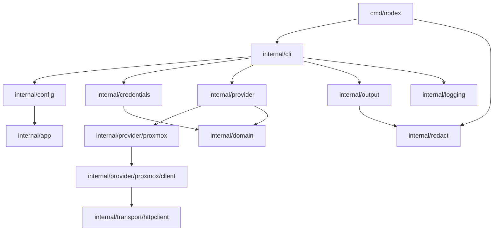

# Architecture

Nodex is a single-process Go CLI. The command entry point wires signal handling, command parsing, configuration, credential resolution, provider connections, output formatting, and redacted error reporting.

## Component overview



## Package layout

```text
cmd/nodex/                         Process entry point and signal handling
internal/app/                      Shared application errors and exit codes
internal/cli/                      Command registration, global flags, handlers, shell completion
internal/config/                   YAML schema, config paths, validation, atomic writes, locking
internal/credentials/              Credential backends and resolution
internal/domain/                   Provider interface and shared resource types
internal/logging/                  Stderr logger and log levels
internal/output/                   Table, JSON, YAML, redaction-aware formatting helpers
internal/provider/                 Provider registry and capability helpers
internal/provider/proxmox/         Proxmox provider implementation and resource mapping
internal/provider/proxmox/client/  Minimal Proxmox HTTP API client
internal/redact/                   Secret redaction helpers
internal/transport/httpclient/     HTTP client with TLS, timeout, retry, body limits
internal/version/                  Build metadata resolution
```

## Runtime flow

1. `cmd/nodex/main.go` creates a cancellable context and registers SIGINT/SIGTERM handlers.
2. `internal/cli.Run` parses global flags with Go's `flag` package.
3. The CLI dispatches to a command handler registered in `internal/cli/root.go`.
4. Commands that need provider access read the configuration, choose a profile, resolve credentials, create the provider, and defer provider cleanup.
5. The Proxmox provider uses the internal Proxmox client to call read-only API endpoints.
6. Command handlers render table, JSON, or YAML output.
7. Returned errors are redacted and terminal-sanitized before they are printed by `main`.

## Provider interface

Providers implement `internal/domain.Provider`:

```go
type Provider interface {
    Name() string
    Version() string
    Connect(ctx context.Context, endpoint string, credentials *Credentials) error
    Close() error
    Capabilities() []Capability
    Nodes(ctx context.Context) ([]Node, error)
    VMs(ctx context.Context) ([]VM, error)
    Containers(ctx context.Context) ([]Container, error)
    Storage(ctx context.Context) ([]Storage, error)
    Cluster(ctx context.Context) (*Cluster, error)
}
```

Providers are registered by name through `internal/provider.Register`. The Proxmox provider registers itself from its package `init` function.

## Proxmox provider

The current Proxmox provider:

- normalizes and validates endpoint URLs;
- authenticates with Proxmox's `PVEAPIToken` authorization scheme when token credentials are present;
- fetches `/api2/json/version` for connectivity and cluster version data;
- fetches `/api2/json/nodes` for node data;
- fetches `/api2/json/cluster/resources` for VM, container, and storage data;
- maps Proxmox API response fields into `internal/domain` resource types.

The provider exposes these capabilities: `cluster`, `containers`, `nodes`, `storage`, and `vms`.

## Configuration and credentials

`internal/config` owns schema validation, platform-specific paths, atomic writes, and config-file locking. Schema version `1` is the only supported version.

Credential resolution is implemented in `internal/credentials`:

- explicit `credential_ref` values are resolved directly;
- profiles without `credential_ref` try environment variables first and then a same-name file credential;
- file credentials are JSON files under `~/.nodex/credentials/`;
- keyring credentials use the OS keyring through `github.com/zalando/go-keyring`;
- stdin and environment backends are read-only.

See the [configuration reference](configuration.md) for user-facing details.

## HTTP transport

`internal/transport/httpclient` wraps `net/http` with:

- default timeout of `30s`;
- TLS minimum version 1.2;
- optional custom CA file support;
- no insecure TLS mode;
- maximum successful response body size of 50 MiB;
- maximum API error body size of 256 KiB;
- up to 2 retries for non-TLS transport errors and HTTP 5xx responses;
- retry delays starting at 200 ms, capped at 500 ms, with ±25% jitter.

TLS and certificate errors are not retried.

## Output and redaction

The output package provides table, JSON, and YAML helpers. User-facing error messages and raw formatter writes pass through `internal/redact`; process-level errors are also passed through terminal sanitization before printing.

Resource output is intentionally shaped by domain structs rather than Proxmox API responses. Table output favors human readability; JSON and YAML preserve structured field names from the domain types.

## Exit and cancellation behavior

Application errors can carry explicit exit codes through `internal/app.ExitCoder`. Unclassified errors exit with code `1`. The entry point converts SIGINT to exit code `130` and SIGTERM to exit code `143` after cancelling the command context.

## Security boundaries

Current security-relevant boundaries include:

- provider commands are read-only;
- endpoint validation requires HTTPS and rejects user info, query strings, fragments, and unexpected paths;
- there is no insecure TLS option;
- credential names are validated before file or keyring operations;
- config writes and credential writes use restrictive modes where supported;
- error output is redacted and terminal-sanitized.

The repository does not currently contain release-signing automation or a vulnerability-scanning CI job.
